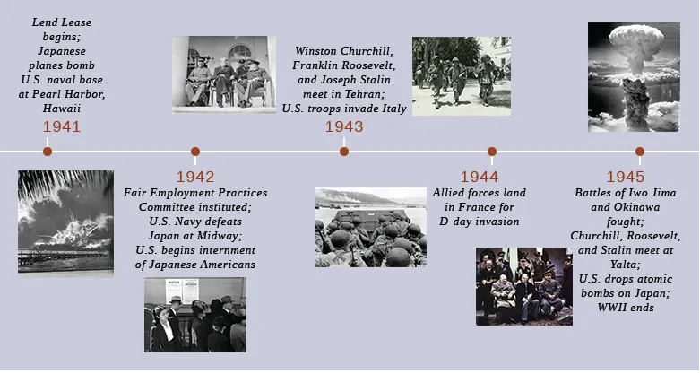

# History

Raymond Flores -
11-2-23 -
Pd. 5
 b

* The reason for the U.S involvement in WWII is the bombing of pearl harbor

* In 1944 Allies landed in France for what is now known as D-Day

* In 1945 The U.S dropped two attomic bombs in Japan killing millions

[Bombing of Japan](https://www.youtube.com/watch?v=vv4VhZy2L5Y 'Go to Youtube')
