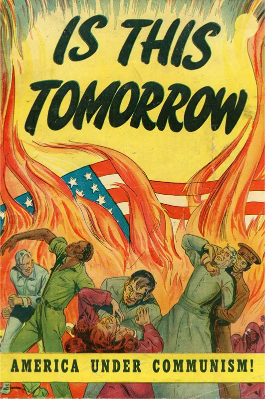

# History 

 Raymond Flores 11-9-23 Pd.5

 ## Chapter 28

[WAR](https://www.youtube.com/watch?v=jA9neyKI62k 'Go to Youtube')

Key Terms

* Baby Boom - A marked increase in the US birthdate during 1946-1964

* Blacklist -  A list of people suspected of having Communist sympathies who were denied work as a result 

* Cold War - the prolonged period of tension between the United States and the Soviet Union, based on ideological conflicts and competition for military, economic, social, and technological superiority, and marked by surveillance and espionage, political assassinations, an arms race, attempts to secure alliances with developing nations, and proxy wars

* containment - the U.S. policy that sought to limit the expansion of Communism abroad

* desegregation - the removal of laws and policies requiring the separation of different racial or ethnic groups
domino theory
the theory that if Communism made inroads in one nation, surrounding nations would also succumb one by one, like a chain of dominos toppling one another

* Fair Deal - President Harry Truman’s program of economic and social reform

* GI Bill - a program that gave substantial benefits to those who served in World War II

* Iron Curtain - a term coined by Winston Churchill to refer to portions of Eastern Europe that the Soviet Union had incorporated into its sphere of influence and that no longer were free to manage their own affairs

* Little Rock Nine - the nickname for the nine African American high school students who first integrated Little Rock’s Central High School

* Marshall Plan - a program giving billions of dollars of U.S. aid to European countries to prevent them from turning to Communism

* Sputnik - the first manmade orbital satellite, launched by the Soviet Union in October 1957

* states’ rights - the political belief that states possess authority beyond federal law, which is usually seen as the supreme law of the land, and thus can act in opposition to federal law